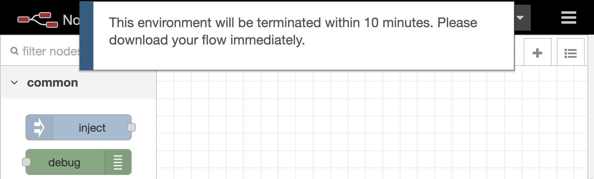

# node-red-contrib-plugin-notify
Custom notification dialog for Node-RED flow editor

Install
-------

Run the following command in your Node-RED user directory - typically `~/.node-red`

        npm install node-red-contrib-plugin-notify

Usage
-----

### Method 1: POST request 
When Node-RED instance receives the POST request to 'http://localhost:1880/notify' with JSON data including message and options, Node-RED flow editor will popup the notification dialog.       

#### (1) Simple example

_curl command_

``
curl -X POST -H 'Content-Type: application/json' -d '{"message": "Hello"}' http://localhost:1880/notify
``

_Screenshot_


#### (2) Advanced example using options

_curl command_

``
curl -X POST -H 'Content-Type: application/json' -d '{"message":"Hello","options":{ "type":"error","timeout":10000,"buttons":[{"text":"OK","class":"primary"}]}}' http://localhost:1880/notify
``

_Screenshot_


#### JSON format to post

```
{
    "message": "text",                     // Text which is displayed on the dialog
    "options": {
        "type": "(success|warning|error)", // Style of the message dialog
        "timeout": 5000,                   // Milliseconds until closing the dialog (default: 5000)
        "modal": (true|false),             // Whether user interaction is disabled until closing the dialog (default: false)
        "width": 800,                      // Pixels of the dialog width
        "buttons": [{                      // Array that contains button configurations
            "text": "text",                // Text which is used in the button
            "class": "primary"             // The class of the button (When it is 'primary', the color of the button is red)
        }]
    }
}
```

Note: If the authentication of the flow editor is enabled, you need to obtain the access token.

### Method 2: Timer from starting Node-RED
The configuration should be specified in command-line arguments or the settings.js file. 

#### (1) Command-line arguments example
In this example, the temporary environment will show the message before terminating the environment.

_Starting Node-RED with arguments_

``
node-red -D notify.message='This environment will be terminated within 10 minutes. Please download your flow immediately.' -D notify.timer=3000000
``

_Screenshot after 50 minutes_



#### (2) settings.js file example
This example is to show a notification when the Node-RED is updated.

_settings.js file_

```
module.exports = {
    notify: {
        message: 'New version of Node-RED is available',
        trigger: function (done) {
            require('request')({ url: 'https://registry.npmjs.org/node-red', json: true }, function (err, res, body) {
                if (!err && body['dist-tags'].latest !== require('./settings').version) {
                    done();
                }
            });
        },
    },

    // the tcp port that the Node-RED web server is listening on
    uiPort: process.env.PORT || 1880,
```

_Screenshot when an update is detected_

